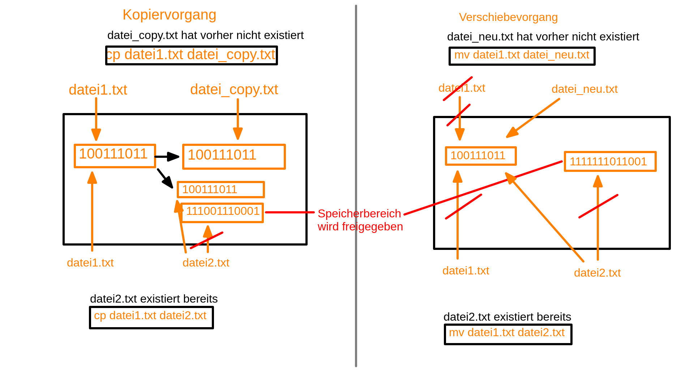

= Dokumentation Linux LF10b
:toc:

== Kommandos

Aufbau von Kommandos:

 kommando [-option]... [argument]...

- (Kurz-) Optionen werden von einem einfachen Minuszeichen eingeleitet und bestehen aus einem einzelnen Buchstaben
- mehrere Optionen können (in der Regel in beliebiger Reihenfolge) nach einem einzelnen Minuszeichen stehen
- Optionen geben an, *wie* sich ein Kommando verhält
- abhängig vom Kommando können (mehrere) Argumente übergeben werden
- Argumente geben an, *worauf* sich ein Kommando bezieht
- es kann auch Optionen geben, die direkt ein Argument verlangen. Dies wird direkt hinter die Kurzoption geschrieben (ohne Gleichheitszeichen `=`). Bei Verwendung der Langoption (zwei Minuszeichen) erfolgt die Zuweisung in der Regel mit einem Gleichheitszeichen. 

Beispiel `tar`:

 tar -f /path/to/file
 tar --file=/path/to/file

- es gibt zwei Arten von Kommandos: *intern* und *extern* realisierte. 
  - *intern* realisierte Kommandos werden von der Shell (z.B. `BASH`) direkt bereitgestellt
  - *extern* realisierte Kommandos sind zusätzlich als eigene Pakete installiert

== Grundlegende Kommandos

- `whoami` angemeldeten Benutzer anzeigen
- `pwd` aktuelles Verzeichnis ausgeben
- `mkdir <verzeichnis>` Verzeichnis anlegen
- `ls` Verzeichnisinhalt anzeigen
  - `ls -a` auch versteckte Dateien (welche mit einem Punkt beginnen anzeigen)
  - `ls -lah` detaillierte Informationen, versteckte Dateien und Grössen in menschenlesbarere Form (KiB, MiB, GiB ...)
- `cd <verzeichnis>` ins Verzeichnis `<verzeichnis>` wechseln
- `cd` ins Heimatverzeichnis wechseln
- `cd ~` ins Heimatverzeichnis wechseln
- `cd /home/<user>` ins Heimatverzeichnis wechseln
- `cd -` ins vorherige Verzeichnis wechseln
- `cd ..` ins übergeordnete Verzeichnis wechseln
- Pfadangaben:
  - *absolut* vollständiger Pfad, immer beginnend mit dem Wurzelverzeihnis (`/`)
  - *relativ* ausgehend vom aktuellen Verzeichnis, beginnt *nie* mit einem Slash (`/`)
- `touch <datei>` kann verwendet werden, um leere Dateien zu erstellen
- `clear` Bildschirminhalt leeren (Tastenkombination `STRG+L`)
- `date` aktuelles Datum und Uhrzeit ausgeben, Ausgabe kann formatiert werden, z.B. `date "+%d.%m.%Y"` -> `19.09.2023`
- `history` Anzeige der zuletzt eingegebenen Kommandos
- `cat <file>` gibt den Inhalt von `<file>` auf der Konsole aus
- `less <file>` gibt den Inhalt von `<file>` im Pager `less` aus. So können wir in der Datei scrollen, suchen usw.

== Hilfe auf der Kommandozeile

- die Kurzhilfe zu einem Kommando kann (in der Regel) über die Option `--help` (manchmal auch `-h`) aufgerufen werden
- eine ausführliche Hilfe bieten die Manpages, aufrufbar duch das Kommando `man <kommando>`
- intern realisierte Kommandos haben keine eigene Manpage. Hilfe dazu erhält man mittels `help <kommando>` bzw. sind diese in der Manpage der `BASH` enthalten- bei der Angabe vom Kommandos und Pfaden sollte immer die Autovervollständigung (mittels TAB-Taste) genutzt werden
- alle eingegebenen Kommandos werden in der `history` gespeichert. Über die Pfeltasten können ältere Kommandos aufgerufen werden
- mit der _History Expansion_ kann einfach auf in der Vergangenheit eingegebene Kommandos zugegriffen werden: `!107` führt das Kommando mit dem Index `107` erneut aus. Weiteres siehe `man history`

== Tastenkombinationen

- `STRG+L` Kommando `clear`
- `STRG+C` sendet Signal `SIGINT` an Kommando (ähnlich wie _Abbrechen_)

== Grundlegende Dateioperationen

- `cp <quelle> <ziel>`: kopiert `<quelle>` nach `<ziel>`. Sowohl `<quelle>` als auch `<ziel>` können reguläre Dateien oder Verzeichnisse sein. 
  - ist `<ziel>` eine Datei die nicht existiert, wird diese erstellt, existiert die Datei wird sie (ohne Nachfrage) überschrieben
  - ist `<ziel>` ein Verzeichnis, wird die Datei hineinkopiert, eine beretis vorhandene Datei würde auch überschrieben werden
  - ist `<quelle>` ein Verzeichnis, so müssen wird die Option `-r` (rekursiv) verwenden: `cp -r mydir/ another_dir/`
- `mv <quelle> <ziel>` verschiebt `<quelle>` nach `<ziel>`. Sowohl `<quelle>` als auch `<ziel>` können reguläre Dateien oder Verzeichnisse sein.
  - bei `mv` gibt es keine Option `-r`, da wir hier nicht rekursiv vorgehen müssen. Siehe Screenshot:

- `rm <datei>` löscht `<datei>` ohne Nachfrage
- `rm -r <verzeichnis>` löscht `<verzeichnis>` mit Inhalt ohne Nachfrage
- `rmdir <verzeichnis>` löscht `<verzeichnis>`, aber nur, wenn es leer ist
- Option `-i` gilt für `cp`, `mv` und `rm`: Nachfrage, falls Ziel überschrieben oder gelöscht werden soll

== Wildcards / Globbing Characters

- `*` (Asterisk) steht für ein beliebiges Zeichen, das beliebig oft vorkommen darf
- `?` steht für ein beliebiges Zeichen, das exakt einmal vorkommen darf
- Beispiele: 
  - `ls *.txt` listet alle Textdateien
  - `rm file*` löscht alle Dateien, die mit `file` beginnen
  - `rm -r *` löscht alle Dateien und Verzeichnisse im aktuellen Verzeichnis (unwideruflich - Gefahr!)

== Variablen

- es gibt zwei Arten von Variablen: 
  - _Systemvariablen_/_Umgebungsvariablen_: Diese sind systemweit in jeder Shell existent und gültig und werden nach Konvention komplett in Großbuchstaben gescchrieben
  - _Shellvariablen_: gelten nur für die Shell, in der sie definiert wurden. Werden nicht automatisch vererbt oder weitergereicht, könenn aber exportiert werden. Dann sind sie auch in Subshells gültig. Werden nach Konvention in Kleinbuchstaben geschrieben
  - Beispiele:
    - `foo=bar` Erstelle die Variable `foo` und weise ihr den Wert `bar` zu
    - `echo $HOME` Zeige den Inhalt der Umgebungsvariabel `HOME` an
    - `echo $foo` Zeige den Inhalt der Shellvariable `foo` an
    - `export foo` Mache `foo` auch in Subshells verfügbar
- wollen wir eigenen Variablen definieren, die systemweit auch über einen Neustart hinaus gültig sind, so müssen wir diese in einer geeignetetn Datei definieren

== Aliase

Mit Aliasen können Kommandos, Pfadangaben usw. "abgekürzt" werden. Beispiele:

 alias ll='ls -l'
 alias df='df -h'

Wird der Alias auf der Kommandozeile erstellt, ist er nur für diese eine Shell gültig. Sollen Aliase systemweit und über einen Neustart hinaus gültig sein, so müssen diese in einer Datei (z.B. `~/.bashrc` oder `~/.bash_aliases` definiert werden.

== Umleitungen und Redirects

=== UNIX Philosopie

- Schreibe Programme so, dass sie nur *eine* Aufgabe erledigen und diese gut machen
- Schreibe Programme so, dass sie zusammenarbeiten
- Schreibe Programme so, dass sie Textströme verwenden, denn das ist eine universelle Schnittstelle

=== Kanäle

- `stdin` Standardeingabekanal - `0`
- `stdout` Standardausgabekanal - `1`
- `sterr` Standardfehlerkanal - `2`

=== Redirects

Mit Redirects lassen sich obige Kanäle in *Dateien* umleiten:

- `>` einfacher Redirect: Ausgabekanäle können in eine *Datei* umgeleitet werden. Achtung: Inhalt wird überschrieben
- `>>` doppelter Redirect: Ausgabekanäle können in eine *Datei* umgeleitet werden. Inhalt wird nicht überschrieben, Ausgabe wird angehängt

=== Umleitungen (mit der Pipe |)

Mit der Pipe (`|`) können wir den Ausgabekanal eines Kommandos in den Eingabekanal eines anderen Kommandos umleiten:

 kommando1 | kommando2

 ls /etc | less

Leitet die Ausgabe von `ls` in den Pager `less` um

Redirects und Umleitungen können kombiniert werden. Oft werden sog. Komandopipelines erstellt, d.h. eine Kombination aus meheren Umleitungen. Beispiel:

 grep -wr alias ~ | grep -v \# | grep -v _history | grep -v txt | cut -d: -f2

Mit obigem Kommando lassen wir uns alle Aliasdefinitionen in unserem Heimatverzeichnis ausgeben, eliminieren aber alle Kommentare usw. von der Ausgabe.

== Kommandosubstitution

Ähnlich wie die _Variablensubstitution_, nur dass das Kommando durch seine Standardausgabe ersetzt wird. Nützlich z.B. wenn wir die Ausgabe eines Kommandos in einer Variablen speichern wollen.

Beispiel:

 cur_date_time=$(date "+%d.%m.%Y, %H:%M.")

Es gibt zwei Syntaxen:

 $(kommando) 
 `kommando`

In beiden Fällen wird das Kommando in einer Subshell ausgeführt. Kommandosubstitutionen können auch verschachtelt sein.

== Prozesse

Jedes Programm, das ausgeführt wird, resultiert in mindestens einem Prozess. Ein CPU-Kern kann in der Regel genau einen Prozess gleichzeitig ausführen, der _Scheduler_ übernimmt die Zuweisung von CPU-Zeit pro Prozess.

Prozesse sind voneinander unabhängig und haben keine Kenntnis über andere Prozesse. Mit einer Ausnahme: Jeder Prozess kennt die PID seines Elternprozesses, also des Prozesses, der ihn gestartet hat.

Wird der Elternprozesses beendet, beendet sich der Kindprozess mit.

Prozesse können im Vordergund oder im Hintergrund ausgeführt werden.

=== Signale

Prozesse können über Signale beeinflusst werden. Sie können z.B. in den Hintergrund verschoben, angehalten, gestartet und gestoppt werden. Dies erfolgt über das Kommando `kill`, welches die PID als Parameter erwartet.

 kill 1234             # sendet SIGTERM an den Prozess mit der PID 1234
 kill -2 1234          # sendet SIGTINT an den Prozess mit der PID 1234
 kill -SIGHUP 1234     # sendet SIGHUB an den Prozess mit der PID 1234

Obige Signale werden von den Prozessen an sich ausgeführt. Reagiert ein Prozess überhaupt nicht mehr, kann oft noch mit dem Signal `SIGKILL` beendet werden. Dies wird direkt an den Scheduler gesendet, der daraufhin den Prozess aus der Liste der auszuführenden Prozesse entfernt, der Prozess wird also zwangsläufig beendet.

Eine Liste aller Signale erhalten wir mit `kill -l`.

== Verzeichisse unter Linux

- `bin`: von regulären Benutzern ausführbare Dateien, _Binaries_
- `boot`: Teile des Bootloaders, Kernelimage etc.
- `dev`: Gerätedateien (Festplatten, Terminals, Random ...)
- `etc`: systemweite Konfigurationsdateien
- `home`: enthält die Heimatverzeichnisse der regulären Benutzer
- `lib`: Libraries
- `media`: Ort, um weitere Datenträger einzubinden 
- `mnt`: Ort, um weitere Datenträger einzubinden (temporär)
- `opt`: Ort für Programme, die nicht über die Standardpaketquellen installiert werden 
- `proc`: Temporäres Dateisystem, hier werden Informationen über alle Prozesse abgelegt
- `root`: Heimatverzeichnis des Benutzres `root`
- `run`: Daten laufender Programme (z.B. Sperrdateien etc.)
- `sbin`: nur von `root` ausführbare Binaries
- `srv`: Verzeichniss, wo Dateien von Serverdiensten abgelegt werden können
- `sys`: Erweiterung von `proc`
- `tmp`: Temporäre Dateien
- `usr`: _Unix System Resources_: Enthält `bin`, `sbin` usw. als Unterverzeichnisse
- `var`: Logdateien, E-Mails, (unter Debian) Dateien die ein Webserver ausliefert ...

== Benutzer und Gruppen

Es gibt zwei Arten von Benutzern: _reale Benutzer_ und _System- bzw. Pseudobenutzer_. 

_Reale Benutzer_ können sich über eine interaktive Login-Shell am System anmelden und Kommandos ausführen. 

_Systembenutzer_ können sich *nicht* am System anmelden und Kommandos ausführen. Sie sind dazu da, dass Dienste (Daemons, Services) unter deren Rechten laufen, so dass sie nicht mit Root-Rechten laufen müssen.

Benutzer werden mit dem Kommando `useradd` angelegt. Unter Debian gibt es auch das interaktive Kommando `adduser`.

=== useradd

Beispiel:

 useradd -m -c 'Karla Testara' -s /bin/bash karla

Legt den User `karla` an, mit `-m` wird das Heimatverzeichnis angelegt und alle Dateien aus dem Verzeichnis `/etc/skel` hineinkopiert. Über `-c` (Comment/GECOS Feld) kann der volle Name angegeben werden. Mit `-s` definieren wir die Login Shell.

Ein neu erstellter User hat noch kein Passwort, dies muss manuell mit dem Kommando `passwd` erstellt werden. Passwörter stehen in der Datei `/etc/shadow`.

=== usermod

Mit `usermod` kann ein User nachträglich verändert werden. Die Optionen sind fast komplett identisch zu `useradd`.

Das Kommando wird auch verwendet, um einen User einer existierenden Gruppe hizuzufügen. Achtung, ohne die Option `-a` werden alle bestehenden Grupenzugehörigkeiten gelöscht.

 usermod -aG sudo karla

Fügt User `karla` der Gruppe `sudo` hinzu.

=== adduser

`adduser` ist interaktiv und setzt direkt ein Passwort. 

=== groupadd

Erstellt eine neue Gruppe. 

=== userdel

Entfernt einen Benutzer. Mit der Option `-r` wird auch das Heimatverzeichnis mit gelöscht.

=== groupdel

Entfernt eine Gruppe, solange dies nicht die primäre Gruppe eines Users ist.

== Berechtigungen

== Paketverwaltung

Unter Linux werden Programme mittels _Paketen_ über eine Paketverwaltung installiert bzw. deinstalliert. Die Pakete liegen auf speziellen Servern, die sog. _Spiegelserver_ oder _Mirrors_.

 apt update             # Paketquellen aktualisieren
 apt ugrade             # aktualisiert ALLE Pakete auf einmal
 apt install <paket>    # <paket> installieren
 apt remove <paket>     # <paket> entfernen, Konfigurationsdateien bleiben auf dem System
 apt remove --purge <paket> # <paket> entfernen, Konfigurationsdateien werden mit entfernt
 apt purge <paket> # <paket> entfernen, Konfigurationsdateien werden mit entfernt
 apt search <name>      # Suche nach Paketen mit Namen/Bezeichnung <name>

Bei der Installation von Paketen werden eventuelle _Abhängigkeiten_/_Dependencies_, also weiter Libraries oder Pakete die für die Auführung des Programms notwendig sind, automatisch mit installiert.

